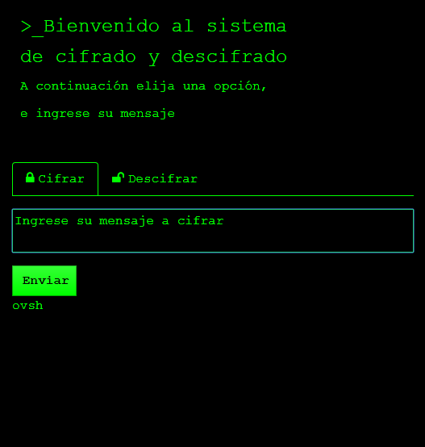

# Cifrado Cesar

## Introducción

En criptografía, el cifrado César, también conocido como cifrado por desplazamiento, código de César o desplazamiento de César, es una de las técnicas de cifrado más simples y más usadas. Es un tipo de cifrado por sustitución en el que una letra en el texto original es reemplazada por otra letra que se encuentra un número fijo de posiciones más adelante en el alfabeto. Por ejemplo, con un desplazamiento de 3, la A sería sustituida por la D (situada 3 lugares a la derecha de la A), la B sería reemplazada por la E, etc.
En este programa usted podrá elegir la opción de desplazamiento, ingresando la frase y la clave.

## De la página web:
* Se utilizó boostrap 4 para el diseño.
* Para la funcionalidad se trabajó con ES6.

### Versión movil

### Versión Desktop

